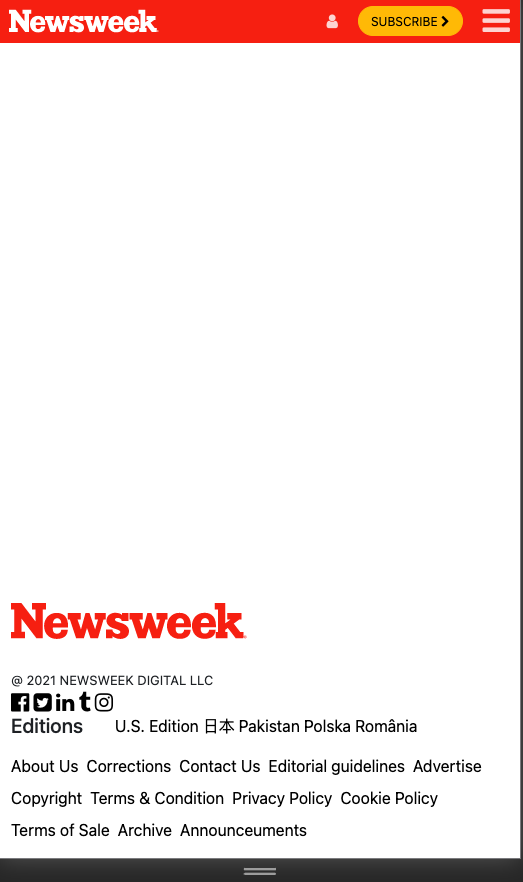
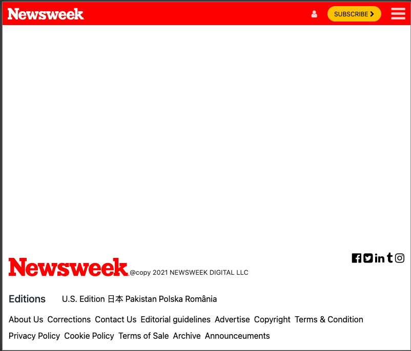
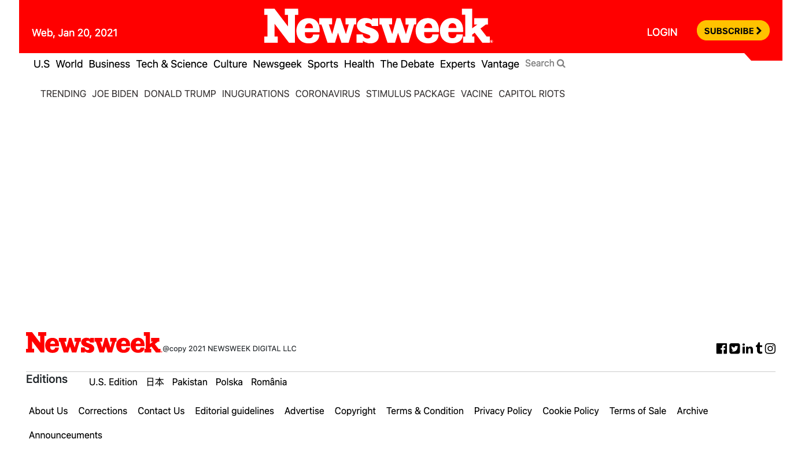

# tnw-clone

> NewsWeek clone using html , css and bootstrap

## Built with

- HTML
- CSS
- BOOTSTRAP

## Live Demo

[Live Demo Link]https://juxsalley.github.io/news-week-clone/)

working on this project, you will learn the basic use of css flex-box and css grid and how to use it's adantages to layout elements on a web page and make it responsive

### Prerequisites

- Text Editor
- internet brower

### Setup

- git clone <link-of-the-repo>
- cd repo-folder
- open in browser

### Install

- No instalation required!

## Authors

👤 **Author1**

- GitHub: [@githubhandle](https://github.com/juxsalley)
- Twitter: [@__salley](https://twitter.com/__salley)
- LinkedIn: [LinkedIn](https://www.linkedin.com/in/dev-salley/)

👤 **Author2**

- GitHub: [@githubhandle](https://github.com/nganifaith)

## 📝 License

This project is [MIT](./LICENSE) licensed.
